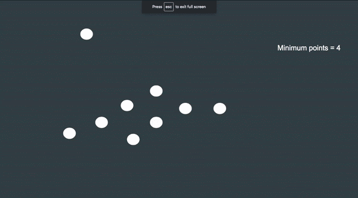

### Density-Based Spatial Clustering of Applications with Noise (DBSCAN)

DBSCAN is a clustering algorithm which focuses on the proximity and density of observations to form clusters.

### How does it work?

DBSCAN basically works by classifying each and every point in the dataset into one of three categories:
1. Core Point:
A point is classified as core point if it has greater than or equal to a given minimum number of points within a given radius.

2. Edge/Border Point:
A point which is not classified as a core point i.e the number of neighbouring point within radius is less than the minimum number of points, but it had a core point present within the radius, that is known as an edge point.

3. Noise Point:
All other points which are not edge or core points are known as noise points.

### Example
In the picture shown below, the red coloured points are the core points, the yellow coloured are the edge points and the blue coloured are the noise points.

Here the minimum number of points i.e minpoints = 4

Therefore, everytime there are 4 or more points within the given radius, the point is coloured red, or core point.

At the edge, there is only one point within the given radius, and that point is a core point. Hence it is coloured yellow, or edge point.

There is only one point in this dataset which does not have any points within its radius, hence it is coloured blue or noise point.

### Usage

- Clone the Repository and enter the appropriate directory

        git clone https://github.com/sashrika15/Unsupervised_Learning_Algorithms

- Change to DBSCAN directory

        cd clustering/DBSCAN
        
- Setting up the Python Environment with dependencies

        pip install -r requirements.txt

- Run test file

        python test.py
        
### Result from implementation

Radius = 0.2

Minpoints = 10

Number of clusters: 2

Contributed by: [Sashrika Surya](https://github.com/sashrika15)
