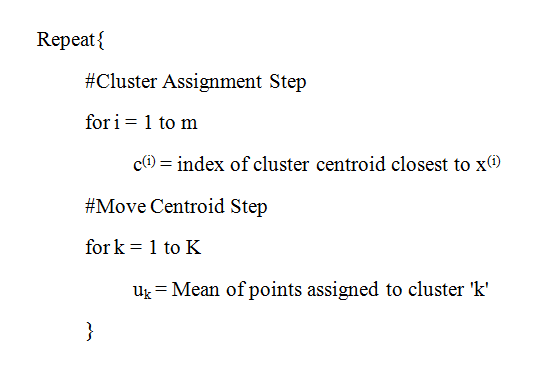
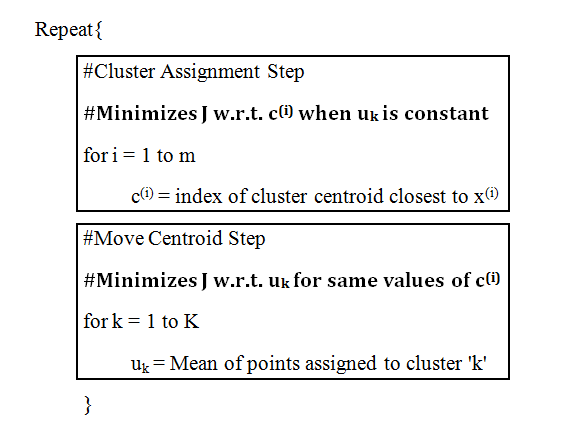

# KMeans-Clustering - The most widely used clustering algorithm!

Clustering Algorithms learn from unlabeled data by finding some structure in the given training set. The following figure will illustrate the concept:

 

## Working:
- Our objective is to group the unlabeled data into k clusters. K-Means is an iterative algorithm. So, first we are going to randomly initialize k points (since we want to group the data into k clusters), known as cluster centroids. 

- The algorithm goes through each of the examples and depending on which cluster centroid they are closer to, it assigns each of the data points to one of the cluster centroids. This step is called the “Cluster Assignment Step”.

- The second part of the iteration is called the “Move Centroid Step”. The two cluster centroids are taken and moved to the average of their corresponding data points. Specifically, we are going to compute the mean of the points’ location for each of the two clusters already formed and move the centroids to their respective cluster means.

- The algorithm continues with the specified number of iterations performing Cluster Assignment and Move Centroid steps iteratively and eventually K-Means converges.
 

## Algorithm:

 

## Application:
The K-Means Algorithm scales really well to large datasets, generalized to clusters of various shapes and guarantees convergence after a specific number of iterations. However, it fails to yield accurate results if outliers are present or density of the spread of data is not even. Nevertheless, equipped with the quality of adapting easily to new examples, K-Means is still the most widely used Unsupervised Learning Algorithm.
 

## Guidelines to use the code and obtain the graphs 
- Clone the Repository and enter the appropriate directory: 

        git clone https://github.com/sashrika15/Unsupervised_Learning_Algorithms

- Entering the KMeans directory: 

        cd clustering/KMeans
        
- Setting up the Python Environment with dependencies:

        pip install -r requirements.txt

- Running the file:

        python3 test.py
  

## Demonstration:

## Additional Resource
To know more about the K-Means Clustering Algorithm, you may check out my article <a href="https://medium.com/srm-mic/k-means-algorithm-dealing-with-unlabeled-data-747f37697d9?source=friends_link&sk=19469af001b606b65f7a096e015cc63e" target="_blank">here</a>.

Contributed by: <a href="https://github.com/srijarkoroy">Srijarko Roy</a>
