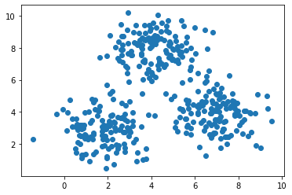
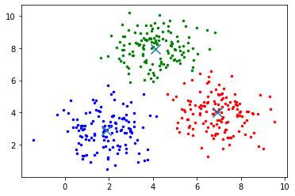

<h1>What is Mean Shift Clustering</h1>
MSC is a centroid based clustering algorithm which iteratively updates centroid in the data till blobs are discovered in the sample provided. It is a type of unsupervised machine learning algorithm. The algorithm works on the concept of Kernel Density Estimation known as KDE. It is also known as mode seeking algorithm.
This algorithm is mostly used for computer vision and image segmentation.

<h2>Pros:</h2>
<ul>
  <li>The output of the algorithm is independent of initializations.</li>
  <li>The procedure is effective as it has only one parameter – Bandwidth.</li>
  <li>It has better performance than K-Means Clustering.</li>
</ul>

<h2>Cons:</h2>
<ul>
  <li>Expensive for large features.</li>
  <li>Compared to K-Means clustering it is very slow.</li>
  <li>Output depends on the size of the window.</li>
</ul>

Basically it is a straightforward approach which primarily used to solve problems related to image segmentation, clustering. It is comparatively slower than K-Means and it is computationally expensive.

It is evident from the image that there are 3 clusters here.
 

 
Results:
The algorithm runs perfectly and segments the 3 clusters with their respective centeroids.

