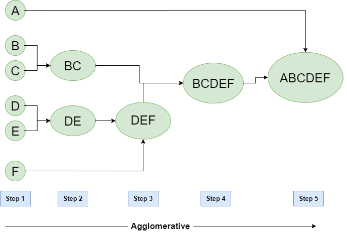

# Agglomerative Hierarchical Clustering
This technique is a bottom up approach in which each datapoint is considered to be an individual cluster. In each iteration the similar clusters merge with other clusters to form either one cluster or K clusters.

## Working
1. Calculate the proximity of individual points and consider easy of these data points to be a cluster.
2. Merge similar clusters to form a single cluster and calculate the proximity of the new clusters.
3. We repeat step 3 till all the clusters are merged and we get a single cluster.

We can use dendrograms to visualize Hierarchical clustering. A dendrogram is a tree-like diagram that record the sequences of merges or splits.

## Usage
- Clone the Repository:

        git clone https://github.com/sashrika15/Unsupervised_Learning_Algorithms

- Enter the hierarchical directory: 

        cd clustering/hierarchical
        
- Install the requirements:

        pip install -r requirements.txt

- Run the file:

        python test.py

Contributed by: <a href="https://github.com/AakritiKinra">Aakriti Kinra</a>
