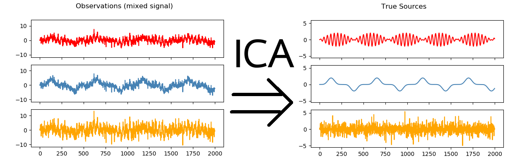
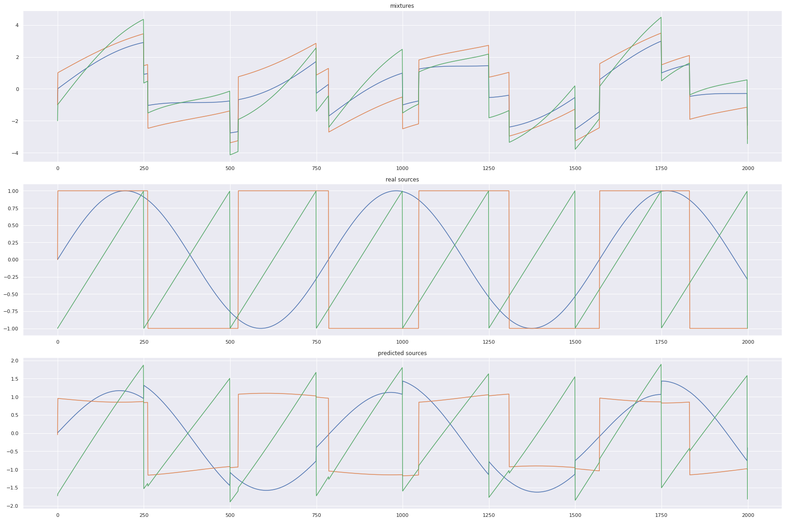

# Independent Component Analysis

Independent component analysis (ICA) is a statistical and computational technique for revealing hidden factors that underlie sets of random variables, measurements, or signals. ICA defines a generative model for the observed multivariate data, which is typically given as a large database of samples. 

Consider you are in a room where several people are talking together and their sounds are sort of mixed. However, if you're talking to a particular person, none of the external sounds prevent you from listening to the person you're talking to since human beings possess the innate ability to differentiate between sounds. Independent Component Analysis tries to decompose a multivariate signal into independent non-Gaussian signals. In other word it tries to separate the mixed sounds into individual independent sounds based on the sources, with respect to our previous example. 

 

## Assumptions
  - Enough relevant data in (x)
  - The source signals are independent of each other
  - The values in each source signal have non-Gaussian distributions (ICA won't be able to extract each individual source)
  
## How it works
We are initially provided with a dataset as data 's' with 'n' independent sources. So essentially the actual data with independent sources 's' is an Rn dimensional vector. 

Let us consider 'x' as our observed data. By intuition, our observed data is the dot product of a Mixing Matrix 'A' and the actual data with independent sources 's'.

### **x = A.s**

The goal for the ICA problem is to recover the actual data 's'. In order to recover 's' we must have a De-mixing Matrix 'w'. This may be achieved with the help of Linear Algebra, taking the inverse of the Mixing Matrix and multiply it on both sides.

### x = A.s
### A^(-1).x = A^(-1).A.s
### W.x = s  [A^(-1) = W]

We can thus recover each individual source by applying W to each measured data point.

## ICA Algorithm
ICA can be broken down into the following steps.

- Centering x by subtracting the mean

  - Centering data around 0
  - Subtract mean from each dimension
  - Add mean back to the estimation of 's' at the end of the problem
  
   

 
 
- Whitening x

  - Independent components must have zero correlation between each other and are assumed to be scaled to have unit variance each, thus is convenient.
  - To “whiten” a given signal means that we transform it in such a way that potential correlations between its components are removed (covariance equal to 0) and the variance of each component is equal to 1
  - Whitening a signal involves the eigen-value decomposition of its covariance matrix described by the mathematical equation :
  
      x(hat) = E(D^-(1/2))(E^T)x

      D : Diagonal matrix of eigenvalues

      E : Orthogonal matrix of eigenvectors

- Choosing a random initial value for the de-mixing matrix w

- Calculating the new value for w

- Normalizing w

- Checking whether algorithm has converged and if it hasn’t, return to step 4

 

 

- Taking the dot product of w and x to get the independent source signals

## Applications
  - Speech Enhancement
  
  - Image Processing
  
    - Denoising
    - Filling in missing data
  
  - Biomedical Signal Processing (EEG, MRI)

## To use repo and obtain the graphs please follow the steps mentioned below
- Clone the Repository and enter the appropriate directory: 

        git clone https://github.com/sashrika15/Unsupervised_Learning_Algorithms

- Entering the Independent Component Analysis directory: 

        cd component_analysis/ICA
        
- Setting up the Python Environment with dependencies:

        pip install -r requirements.txt

- Running the file:

        python3 test.py
  
## Results from Implementation

 

Contributed by: <a href="https://github.com/srijarkoroy">Srijarko Roy</a>

  
