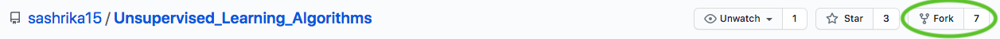
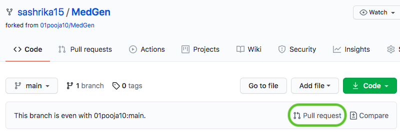

# Contribution Guidelines

This repository was started primarily as a learning intiative so that we can understand algorithms in-depth by writing their code from scratch.

## Why contribute?
- Contribute to your own self-learning by studying an algorithm in depth
- Learn how to implement algorithms from scratch

## How to contribute?

- Decide on an algorithm you want to implement! Once decided, comment on the open issue titled **"Populate with more algorithms"** with your chosen algorithm and its category.
- **Fork the repository.** This can be done by the 'Fork' button on the top right corner of the page.

- Now, in your own fork of the repository, create a folder with the name of your algorithm under the right category. (Note, keep the name short and one-worded as that makes it easier to navigate)
- Code!
- You can use generated datasets from scikit-learn to test your implementation. For details, refer to this [link](https://scikit-learn.org/stable/datasets/sample_generators.html)
- Be sure to provide **proper documentation** so that others can understand your code as well! Add a README.md with the details of your implementation. 
- Include usage guidelines in your README.md, or add a test.py file which tests your algorithm.
- Once you are done, create a pull request! Wait for review to resolve any problems, and merge!

